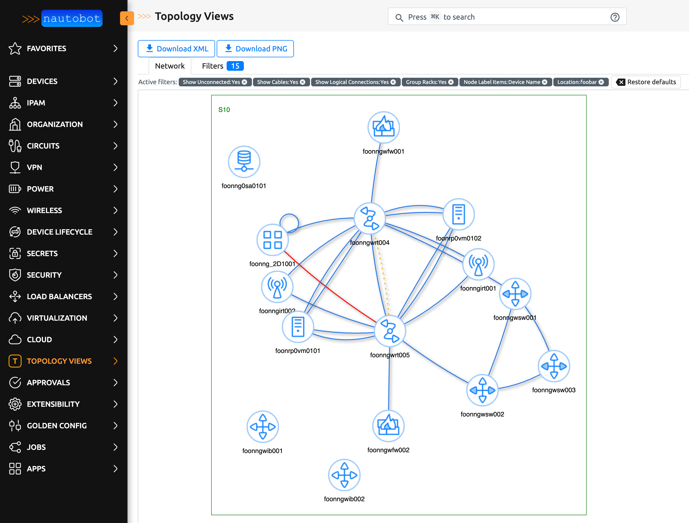

# Nautobot Topology Views App

[](https://pypi.org/project/nautobot-topology-views/)

Create topology views/maps from your devices in Nautobot.
The connections are based on the cables you created in Nautobot.
Support to filter on name, location, tag and device role.  
Options to export to xml (for draw.io/diagrams.net) or png.

> **Note**: This Nautobot app is a port of [Netbox Topology Views](https://github.com/netbox-community/netbox-topology-views).  
>
> Original authors: @mattieserver and netbox-community members.  
> Full list available at https://github.com/netbox-community/netbox-topology-views/graphs/contributors  
>
> Modifications:  
> - Ported to Nautobot
> - Minor UI tweaks
> - Reduce groups overlap

## Preview



## Requirements

- Nautobot 3.1.3 or later
- Python 3.12 or later
- Django 5.2

## Install

The app is available as a Python package and can be installed with Poetry.

### Using Poetry (Recommended)

Add to your Nautobot's pyproject.toml:
```toml
[tool.poetry.dependencies]
nautobot-topology-views = "^4.5.1.0"
```

Then run:
```bash
poetry install
nautobot-server migrate nautobot_topology_views
nautobot-server collectstatic --no-input
```

## Configuration

Enable the app in your `nautobot_config.py`:

```python
PLUGINS = ["nautobot_topology_views"]
```

### Plugin Settings

```python
PLUGINS_CONFIG = {
    "nautobot_topology_views": {
        "static_image_directory": "nautobot_topology_views/img",
        "allow_coordinates_saving": False,
        "always_save_coordinates": False,
    }
}
```

Finally, restart Nautobot:
```bash
systemctl restart nautobot
```

### Versions

| Nautobot version | nautobot-topology-views version |
| ---------------- | ------------------------------- |
| = 3.1.X          | = v4.5.1.0                      |


## Configure

### Individual Options

All individual options can be assigned a default value per user directly in the plugin. The default value can be overridden on the filter page.


The remaining options must be configured in the `PLUGINS_CONFIG` section of your `nautobot_config.py`.

Example:
```
PLUGINS_CONFIG = {
    'nautobot_topology_views': {
        'static_image_directory': 'nautobot_topology_views/img',
        'allow_coordinates_saving': True,
        'always_save_coordinates': True
    }
}
```

| Setting                  | Default value                     | Description                                                                                                            |
| ------------------------ | --------------------------------- | ---------------------------------------------------------------------------------------------------------------------- |
| static_image_directory   | nautobot_topology_views/img       | (str or pathlib.Path) Specifies the location that images will be loaded from by default. Must be within `STATIC_ROOT`  |
| allow_coordinates_saving | False                             | (bool) Set to true if you want to enable the ability to save the coordinates.                                          |
| always_save_coordinates  | False                             | (bool) Set if you want to enable the option to save coordinates by default. Setting allow_coordinates_saving to true is mandatory. |

### Custom field: coordinates

There is also support for custom fields.

>**_Note:_** The custom field "coordinates" is deprecated and will be removed in the future. Please use Coordinate Groups instead.

If you create a custom field "coordinates" for "dcim > device" and "Circuits > circuit" with type "text" and name "coordinates" you will see the same layout every time. It is recommended to set this field to "UI visibility" "Hidden" and let the plugin manage it in the background.

The coordinates are stored as: "X;Y".

> Please read the "Configure" chapter to set the `allow_coordinates_saving` option to True.
You might also set the `always_save_coordinates` option to True.

### Convert custom field to Coordinate Groups

Please note that values stored in the custom field "coordinates" are not being converted to Coordinate Groups automatically. A pragmatic way to do this conversion yourself is as follows:
+ Navigate to "Topology" > "Filters".
+ Select "Show Unconnected" and "Show Cables". 
+ Leave all other filter settings alone. We want all entries to be displayed!
+ Click "Search" and wait for the results to be displayed
+ Select all nodes. This can be done by holding down the Shift key and dragging a frame around all icons with the left mouse button.
+ Drag the selection a tiny bit to the side. This causes all coordinates for all devices to be stored in the "default" group.
> **_Hint_**: Don't wait too long after clicking an icon in order to drag. If you hold the mouse button for too long before dragging starts, the selection is reset._
+ Storing the values might take some time, depending on the number of devices. Please be patient and check "Coordinates" in order to make sure that everthing has been stored.
+ It is save to delete the custom field now.

### Custom Images

To change image with associated device use the `Images` page - it allows to map a device role with an image found in the Nautobot static directory (defined by the plugin config `static_image_directory` which defaults to `nautobot_topology_views/img`). You can also upload you own custom images to there - these images will automatically be used for a device (if it does not already have a specified image in the settings) if their name is the device role slug.


## Use

Go to the plugins tab in the navbar and click topology or go to `$NAUTOBOT_URL/plugins/nautobot_topology_views/` to view your topologies

Select your options for the topology view:


<dl>
    <dt>Coordinate Group</dt>
    <dd>Select Coordinate Group. These groups allow devices to be displayed in different positions depending on the group, thus providing different representations for the same topology. If nothing is selected, the group "default" is set automatically.</dd>
    <dt>Save Coordinates</dt>
    <dd>Save the coordinates of devices in the topology view.</dd>
    <dt>Show Unconnected</dt>
    <dd>Show devices that have no connections or for which no connection is displayed. This option depends on other parameters like 'Show Cables' and 'Show Logical Connections'.</dd>
    <dt>Show Cables</dt>
    <dd>Show connections between interfaces, front / rear ports, etc., that are connected with one or more cables. These connections are displayed as solid lines in the color of the cable.</dd> 
    <dt>Show Logical Connections</dt>
    <dd>Show logical connections between interfaces (referred to as Interface Connections in Nautobot) in the topology view. Where the path between
        interfaces includes multiple cables (e.g., via patch panels), only the end interface connections are shown, not the 
        intermediate front / rear port connections, etc. This is similar to what was referred to as 'end-to-end' connections in previous versions. These connections are displayed as yellow dotted lines.</dd>
    <dt>Show redundant Cable and Logical Connection</dt>
    <dd>Shows a logical connection (in addition to a cable), even if a cable is directly connected. Leaving this option disabled prevents that redundant display. This option only has an effect if 'Show Logical Connections' is activated.</dd>
    <dt>Show Neighbors</dt>
    <dd>Adds neighbors to the filter result set automatically. Link peers will be added if 'Show Cables' is ticked, far-end terminations will be added if 'Show Logical Connections' is ticked.</dd>
    <dt>Show Circuit Terminations</dt>
    <dd>Show connections which end at a circuit termination in the topology view. These connections are displayed as blue dashed lines.</dd>
    <dt>Show Power Feeds</dt>
    <dd>Displays connections between power outlets and power ports. These connections are displayed as solid lines in the color of the cable. This option depends on 'Show Cables'.</dd>
    <dt>Show Wireless Links</dt>
    <dd>Displays wireless connections. These connections are displayed as blue dotted lines.</dd>
</dl>
    
### Coordinates and Coordinate Groups

Nautobot Topology Views stores the position of the devices. In order to allow different representations for the topology, Coordinate Groups are supported.

> Please read the "Configure" chapter to set the `allow_coordinates_saving` option to True.
You might also set the `always_save_coordinates` option to True.

Navigate to "Coordinate Groups" in the menu and create as many groups as you like. You can select a group later in the filter pane in order to show icon positions according to this group (see chapter "Use"). You can also omit creating a group if you don't need this feature. Nautobot Topology Views automatically creates a group named "default" for you and stores all coordinates in this group, even if you do not select a group in the filter.

By default, the position of the devices are calculated with a physics engine. As soon as a device icon is dragged to another location, its position is saved and excluded from the calculation by the physics engine. All saved coordinates can be viewed and edited under the menu item "Coordinates".

> **_Note:_** At the time of writing, it is not possible to store the positions of circuit terminations, power panels and power feeds, as these are not devices.

### Permissions

To view `/plugins/topology-views/topology` you need the following permissions:
 + dcim | device | can view device
 + dcim | site | can view site
 + extras | tag | can view tag
 + dcim | device role | can view device role

To save `Coordinates` when moving icons:
 + nautobot_topology_views | coordinate | change

To view `/plugins/topology-views/images`:
 + dcim | site | view
 + dcim | device role | view
 + dcim | device role | add
 + dcim | device role | change

To view `/plugins/topology-views/individualoptions`:
 + nautobot_topology_views | individual options | change

Set `Coordinate Groups` according to your needs:
 + nautobot_topology_views | coordinate groups | view/add/change/delete

Set `Coordinates` according to your needs:
 + nautobot_topology_views | coordinate | view/add/change/delete

Set `Power Feed Coordinates` according to your needs:
 + nautobot_topology_views | power feed coordinate | view/add/change/delete

Set `Power Panel Coordinates` according to your needs:
 + nautobot_topology_views | power panel coordinate | view/add/change/delete

Set `Circuit Coordinates` according to your needs:
 + nautobot_topology_views | circuit coordinate | view/add/change/delete
